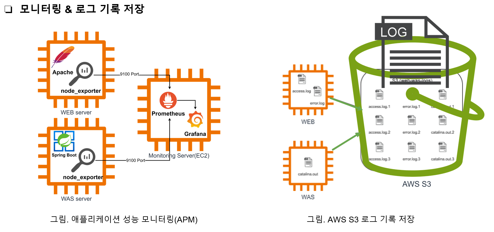
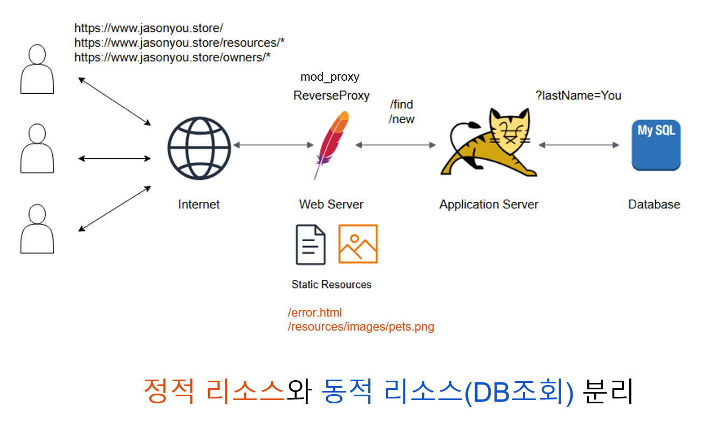
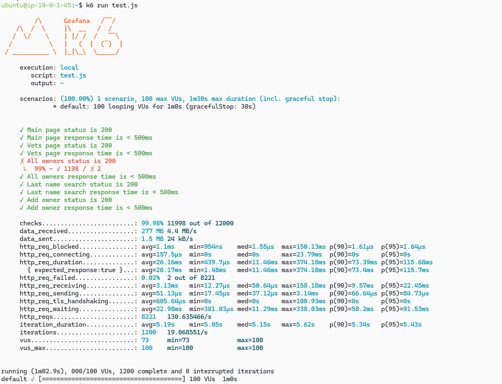
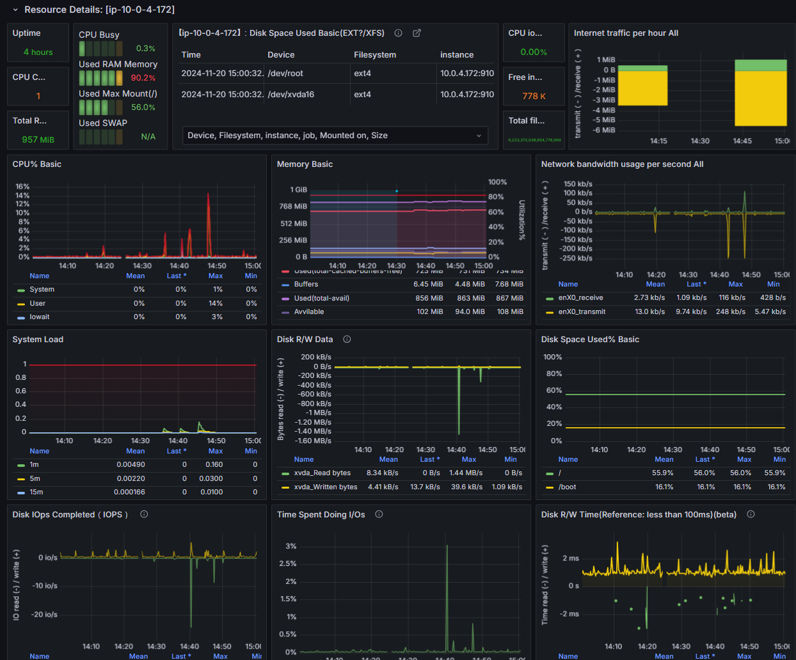

# AWS-3tier-Architecture

3-Tier web service architecture built with AWS, featuring monitoring (Prometheus & Grafana), load testing (K6), and dynamic/static service separation.

---

## Overview


This architecture demonstrates a scalable 3-tier web service structure with:
- **Web Tier**: Manages static resources and routes requests via a reverse proxy (Apache).
- **Application Tier**: Handles dynamic requests using Spring Boot and Tomcat.
- **Database Tier**: Stores persistent data with MySQL.

---

## Features

### 1. **Monitoring & Logging**
Integrated with Prometheus and Grafana for system performance monitoring and logging. Logs are stored in AWS S3 for scalability.



Key functionalities:
- **Real-time metrics collection**: Node Exporter for system metrics.
- **Performance dashboards**: Visualized using Grafana.
- **Log archival**: Saved in AWS S3 for analysis and retention.

---

### 2. **Dynamic and Static Resource Separation**
Implemented reverse proxy (Apache) for efficient routing between static and dynamic resources.



Benefits:
- Faster delivery of static content.
- Optimized backend performance by reducing workload on WAS.

---

### 3. **Load Testing**
Simulated traffic using K6 to test performance under concurrent user scenarios.



Testing Details:
- Simulated 100 virtual users for 1 minute.
- Monitored response times and failure rates.

---

### 4. **Performance Dashboards**
Analyzed resource utilization and system behavior during load testing.



Included metrics:
- CPU, memory, and network usage.
- Disk I/O performance.
- System load averages.

---

## Repository Structure

```plaintext
AWS-3tier-Architecture/
│
├── assets/                     # Image and resource files for documentation
│   ├── 3tier architecture diagram.png
│   ├── grafana-dashboard.png
│   ├── k6-load-test-result.png
│   ├── monitoring-logging-apm.png
│   ├── reverse-proxy-architecture.png
│
└── README.md                   # Project documentation
